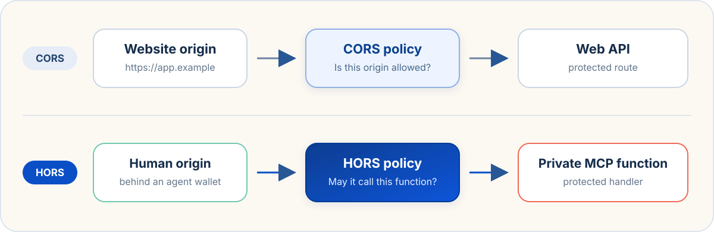
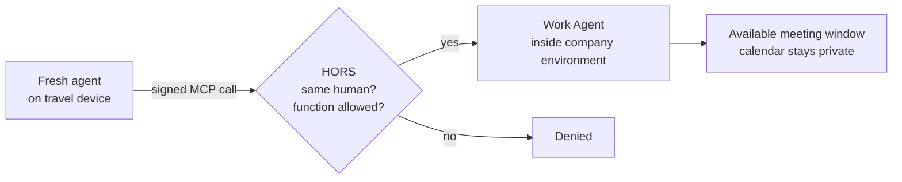
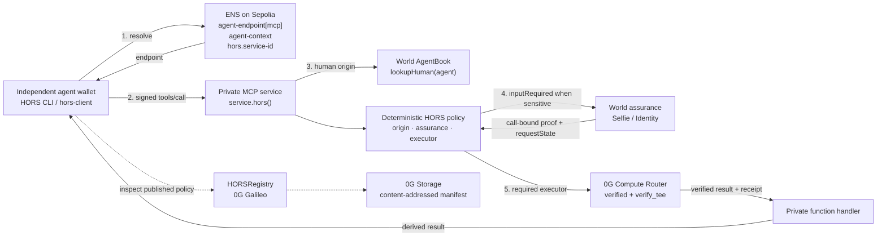

# HORS — Human-Origin Resource Sharing

> **Your agents share functions, not secrets.**

**HORS does for private MCP functions what CORS does for web APIs: it gives each
protected function an origin policy.** CORS evaluates the website origin behind
a request. HORS evaluates the anonymous human origin behind an agent wallet.



The agent keeps its own wallet, model, vendor, and runtime. AgentKit resolves
that wallet to an anonymous `humanId`; HORS evaluates the resulting human origin
against the function's policy before the private handler runs.

```ts
service.hors("work.findMeetingWindow", { origin: "same-human" }, handler);
```

This policy has one literal meaning: the handler accepts calls only from agents
backed by the same anonymous human as the service owner.

[Architecture](docs/ARCHITECTURE.md) ·
[SDK guide](docs/SDK.md) ·
[Call Home demo](examples/call-home/README.md) ·
[Technical specification](draft/SPEC.md) ·
[HORSRegistry](https://chainscan-galileo.0g.ai/address/0x86B773d98d3A7dfE6Cc785CA8F76f7A7Ca85f7b9)

## One request, one decision

Your Work Agent remains inside the company environment, where it already has
access to your calendar, mailbox, documents, and company permissions.

While traveling, you install a fresh agent on another device. The new agent has
its own wallet and no copy of your work data. You ask it to reschedule a customer
meeting:

```ts
work.findMeetingWindow({
  durationMinutes: 60,
  before: "2026-08-15T18:00:00Z",
  timeZone: "Europe/London",
});
```




After the fresh wallet completes AgentKit registration, ENS locates the Work
Agent's current endpoint. The two agents can use different wallets, vendors,
models, and runtimes. HORS verifies the signed call, resolves the fresh wallet
through AgentBook, compares its `humanId` with the Work Agent owner's `humanId`,
and evaluates the function policy before the private handler runs.

The fresh agent receives an available time window, not the calendar. The Work
Agent continues to enforce the company's own permissions; HORS controls which
human-backed sibling agent can invoke each function it exposes.

Sensitive functions add requirements to the same policy:

```ts
service.hors(
  "work.approveTravelExpense",
  { origin: "same-human", assurance: "selfie", executor: "0g" },
  handler,
);
```

Here, origin and Selfie verification complete before the handler runs. The
handler's result leaves the service only with a valid, invocation-bound 0G
execution receipt.

## Why we built it

Personal-agent systems commonly use one of two architectures.

| Architecture | What works | What breaks |
| --- | --- | --- |
| **One super-agent** | It can combine email, finance, calendars, wallets, credentials, and memory. | Prompt injection or one provider compromise creates a system-wide blast radius. |
| **Fully isolated agents** | Each agent exposes less data and limits the blast radius. | The agents cannot cooperate: a fresh travel agent cannot use the calendar or company policies held by the Work Agent. |

HORS implements a third model: **function-level composability over private
state**. The fresh agent never receives this:

```json
{
  "mailbox": ["..."],
  "calendarEvents": ["..."],
  "customerDocuments": ["..."],
  "companyCredentials": ["..."]
}
```

It calls a deliberately narrow function:

```ts
work.findMeetingWindow({
  durationMinutes: 60,
  before: "2026-08-15T18:00:00Z",
  timeZone: "Europe/London",
});
```

and receives only the permitted derived result:

```json
{
  "available": true,
  "start": "2026-08-15T14:00:00Z",
  "end": "2026-08-15T15:00:00Z"
}
```

The raw state stays behind the service boundary. The caller receives a
capability-sized answer, not a database read.

## From CORS to HORS

The name is an analogy, not a claim that agents behave like browsers.


| Web                                          | Human-backed agent services                                                      |
| -------------------------------------------- | -------------------------------------------------------------------------------- |
| DNS locates a website                        | ENS locates an MCP service                                                       |
| A web origin defines a security boundary     | AgentBook `humanId` defines an anonymous human origin                            |
| CORS middleware declares cross-origin policy | `service.hors()` declares per-function policy                                    |
| A browser attaches origin metadata           | `hors-client` signs function, arguments, domain, nonce, call ID, and policy hash |
| The browser enforces part of the boundary    | The HORS service verifies every request server-side                              |


Agents are not trusted user agents, so HORS never relies on the caller to enforce
policy. The service verifies the resource-bound signature, freshness, replay
state, argument hash, domain, and AgentBook relationship before the function
handler runs.

## Call Home: the end-to-end example

`[examples/call-home](examples/call-home/)` is a personal 0G vault exposed as a
HORS-protected MCP service. A fresh coffee-shop agent needs 0G tokens for
inference and calls the owner's home vault without receiving the vault's private
rules or credentials.


| Function                 | HORS policy                  | Demonstrates                                                               |
| ------------------------ | ---------------------------- | -------------------------------------------------------------------------- |
| `home.balance`           | `same-human`                 | AgentKit-gated private access                                              |
| `home.borrow`            | `same-human + selfie + 0g`   | Call-specific human presence, verified inference, and a native 0G transfer |
| `home.emergency`         | `same-human + identity + 0g` | Document-backed identity step-up for a higher-risk operation               |
| `home.exportCredentials` | `agentCallable: false`       | A function that no agent may invoke, including the owner's                 |


The live `home.borrow` path is:

1. `hors connect --fresh` creates a connector wallet and launches AgentKit
  registration in the human's terminal.
2. `hors services openagents.eth` resolves `agent-endpoint[mcp]`,
  `agent-context`, and `hors.service-id` from ENS, then verifies the service ID
  against HORSRegistry.
3. `hors list-functions ... --refresh` reads HORSRegistry, downloads the policy
  manifest from 0G Storage with proof, and verifies its content hash.
4. `hors call ... home.borrow` signs the exact MCP tool call.
5. HORS resolves the caller through AgentBook and requires the same
  `humanId` as the vault owner.
6. The service returns MCP `inputRequired`; the CLI renders a World Selfie Check
  QR and resumes only with a call-bound proof.
7. 0G Compute Router evaluates the already-authorized request in `verified`
  trust mode. HORS requires `tee_verified: true` and binds the receipt to the
   function, arguments, call ID, provider, and returned content.
8. The vault transfers native 0G to the requested address.

The Identity path uses the same resume protocol with World Identity Check.
HORS requests document-backed assurance for the emergency tier while requesting
no name, date of birth, nationality, document number, or raw document image.

## System at a glance




Authorization remains deterministic. The 0G model evaluates a private decision
only after HORS has admitted the request; model output cannot grant itself
access.

## Three load-bearing networks

These integrations are load-bearing in HORS's chosen trust model. Other stacks
could replace an individual component, but doing so changes the portability,
discovery, or verification property HORS is designed to provide.

### World — who backs the caller?

[AgentKit](https://docs.world.org/agents/agent-kit/integrate) validates a
resource-bound agent signature and resolves the agent wallet to an anonymous
`humanId`. Separate wallets registered by the same person share human-level
state, so agents do not need a common vendor account or root wallet.

[Selfie Check](https://docs.world.org/world-id/credentials/11) is used as
call-specific human-presence escalation, not generic login. [Identity
Check](https://docs.world.org/world-id/idkit/credentials#identity-check-preview)
protects the higher-risk path with document-backed assurance. Same-human is
necessary; sensitive functions can still require the human to be present.

### ENS — where is the service?

HORS resolves the [ENSIP-26](https://docs.ens.domains/ensip/26/) text records
`agent-endpoint[mcp]` and `agent-context`, plus the HORS-specific
`hors.service-id` record. The owner can move a service without reconfiguring
every sibling agent. The CLI validates the service ID against the canonical
HORSRegistry and the registry owner's normalized ENS name before caching the
endpoint.

### 0G — what was published, and how was it executed?

- **0G Chain:** HORSRegistry commits the service owner, policy version, policy
content hash, Storage root, and compact function policies.
- **0G Storage:** stores the public, content-addressed policy manifest; the
client verifies the downloaded content against the on-chain hash.
- **0G Compute Router:** executes protected decisions with `verify_tee: true`.
The current Galileo path uses `verified` trust mode and fails closed when TEE
verification is missing.

This is intentionally precise: `verified` execution is not described as sealed
`private` inference. See [0G's privacy
modes](https://docs.0g.ai/developer-hub/building-on-0g/compute-network/router/privacy).

## Why not OAuth, session keys, or credentials?

HORS is not the only possible authorization architecture. It targets a specific
deployment shape: private services used by agents from unrelated vendors with
independent wallets.


| Approach                     | Strongest fit                               | Shared trust root                        | What changes with HORS                                                                  |
| ---------------------------- | ------------------------------------------- | ---------------------------------------- | --------------------------------------------------------------------------------------- |
| MCP OAuth / OIDC             | Delegated client-to-service access          | Authorization server or IdP relationship | Adds an AgentBook-derived same-human relation across unrelated agent wallets            |
| Smart account + session keys | Multiple agents inside one wallet system    | Common root wallet                       | Agents retain independent wallets and vendor identities                                 |
| DID / Verifiable Credentials | User- or issuer-managed portable membership | Issuer and credential lifecycle          | Uses an existing human-backed registry and registration flow                            |
| Solid / ACP                  | Policy-controlled access to data resources  | WebID and credential policy ecosystem    | Defaults to narrow MCP function calls and derived results instead of raw resource reads |
| **HORS**                     | Private sibling-agent functions             | Anonymous World human origin             | Binds origin, function, arguments, policy, assurance, and verified executor per call    |


## SDK in one screen

The server API is intentionally shaped like policy middleware:

```ts
import { createHORS } from "hors-server";
import { z } from "zod/v4";

const service = await createHORS({
  humanOrigin: ownerHumanId,
  domain: "work.alice.eth",
  stateKey: process.env.HORS_STATE_KEY,
  assurance: {
    rpId: process.env.WORLD_RP_ID!,
    signingKey: process.env.WORLD_SIGNING_KEY!,
    appId: process.env.WORLD_APP_ID,
  },
  executors: { "0g": zeroGExecutor },
});

server.registerTool(
  "work.approveTravelExpense",
  {
    description: "Evaluate travel expense without revealing company policy",
    inputSchema: z.object({
      amount: z.number(),
      currency: z.string(),
      purpose: z.string(),
    }),
  },
  service.hors(
    "work.approveTravelExpense",
    { origin: "same-human", assurance: "selfie", executor: "0g" },
    async (args, _mcpContext, horsContext) => {
      const { result, receipt } = await horsContext
        .executor("0g")
        .execute(buildPrompt(args), privatePolicy);

      return {
        content: [{ type: "text", text: result.content }],
        _horsReceipt: receipt,
      };
    },
  ),
);
```

On the caller, `createHORSClient()` wraps an MCP transport and signs every
`tools/call`:

```ts
import { createHORSClient } from "hors-client";

const hors = createHORSClient({
  signer: agentWallet,
  domain: "work.alice.eth",
  policyContentHash,
});

await client.connect(hors.wrapTransport(mcpTransport));
```

See [docs/SDK.md](docs/SDK.md) for configuration, policy semantics, wire
bindings, assurance, verified execution, registry reads, and diagnostics.

## Packages


| Package                                          | Purpose                                                                                                             |
| ------------------------------------------------ | ------------------------------------------------------------------------------------------------------------------- |
| `[hors-core](packages/hors-core/)`               | Protocol types, canonical argument hashing, policies, headers, replay stores, errors, and registry ABI              |
| `[hors-server](packages/hors-server/)`           | `createHORS()`, `service.hors()`, AgentBook verification, MRTR step-up, enrollment, Storage, audit, and diagnostics |
| `[hors-client](packages/hors-client/)`           | MCP transport signing, ENS discovery, HORSRegistry reads, and verified manifest download                            |
| `[hors-assurance](packages/hors-assurance/)`     | World RP context, Selfie Check, Identity Check, signal binding, and nullifier replay protection                     |
| `[hors-executor-0g](packages/hors-executor-0g/)` | 0G Router adapter, trust-mode selection, TEE checks, and optional independent verification                          |
| `[hors-cli](packages/hors-cli/)`                 | Connector profile, discovery, policy inspection, calls, QR step-up, trace viewer, and stdio MCP bridge              |


The packages are workspace packages for this prototype; install them from the
repository.

## Install from source

Requirements: Node.js 20+ and Corepack.

```bash
git clone https://github.com/cqlyj/HORS.git
cd HORS
corepack enable
pnpm install
pnpm build
pnpm check-types

cd packages/hors-cli
pnpm link --global
hors --version
```

Without a global link, run the CLI from the repository root with
`pnpm hors <command>`.

## Install the agent skill

The repository includes `[use-hors-cli](skills/use-hors-cli/SKILL.md)`, a skill
that teaches an agent how to preserve the human QR boundary while using the CLI.

Using the cross-agent Skills CLI:

```bash
npx skills add https://github.com/cqlyj/HORS --skill use-hors-cli
```

For [Codex](https://developers.openai.com/codex/skills/), a local symlink is
also enough:

```bash
mkdir -p "$HOME/.agents/skills"
ln -s "$(pwd)/skills/use-hors-cli" "$HOME/.agents/skills/use-hors-cli"
```

Start a new agent session and invoke `$use-hors-cli`. Review third-party skills
before installing them.

## Choose a runnable example


### Five-minute origin demo

`[hello-hors](examples/hello-hors/)` isolates the core claim: a same-human agent
can call one private MCP tool, while an unrelated wallet is denied.

```bash
pnpm install
pnpm build
cd examples/hello-hors
make register
make server   # terminal 1
make client   # terminal 2
```


### Full demo

`[call-home](examples/call-home/)` adds ENS discovery, HORSRegistry, 0G Storage,
Selfie and Identity step-up, 0G verified execution, and a real Galileo token
transfer.

```bash
cd examples/call-home
make init
# Configure .env with World, ENS, and 0G credentials
make setup
make server
```

The complete operator sequence and environment reference are in the
[Call Home runbook](examples/call-home/README.md).

## Deployed infrastructure


| Component          | Network                      | Evidence                                                                                                                                               |
| ------------------ | ---------------------------- | ------------------------------------------------------------------------------------------------------------------------------------------------------ |
| `HORSRegistry`     | 0G Galileo, chain ID `16602` | [Contract source](contracts/src/HORSRegistry.sol) · `[0x86B…f7b9](https://chainscan-galileo.0g.ai/address/0x86B773d98d3A7dfE6Cc785CA8F76f7A7Ca85f7b9)` |
| Policy manifest    | 0G Storage                   | [Publish/register script](examples/call-home/enroll.ts) · [proof download and hash check](packages/hors-client/src/storage.ts)                         |
| Service discovery  | Ethereum Sepolia ENS         | [Record writer](examples/call-home/set-ens.ts) · [live resolver](packages/hors-client/src/discover.ts)                                                 |
| Human origin       | World AgentBook              | [Resource and AgentBook verification](packages/hors-server/src/verify.ts) · [minimal same/other-human demo](examples/hello-hors/)                      |
| Verified execution | 0G Compute Router            | [Fail-closed executor](packages/hors-executor-0g/src/executor.ts) · [completed Selfie/0G trace](docs/SELFIE_TESTING.md)                                |


## Documentation


| Document                                           | Use it for                                                                             |
| -------------------------------------------------- | -------------------------------------------------------------------------------------- |
| [Architecture and rationale](docs/ARCHITECTURE.md) | Threat model, CORS analogy, protocol roles, alternatives, and trust boundaries         |
| [SDK guide](docs/SDK.md)                           | Package APIs, policies, server/client integration, assurance, execution, and errors    |
| [Call Home runbook](examples/call-home/README.md)  | Complete setup and live demo                                                           |
| [Selfie Check testing](docs/SELFIE_TESTING.md)     | Meaningful-use rationale, implementation feedback, trace evidence, and UX findings     |
| [Identity Check testing](docs/IDENTITY_TESTING.md) | Risk rationale, requested-data explanation, developer feedback, and live test protocol |
| [Technical specification](draft/SPEC.md)           | Wire format, policy model, registry, storage, and protocol details                     |
| [Agent skill](skills/use-hors-cli/SKILL.md)        | Safe CLI operating workflow for Codex and other agents                                 |


## Next frontiers

- A standard A2A extension that advertises human-origin policy without changing
A2A task semantics.
- Owner-controlled ENS service graphs for fleets of replaceable personal agents.
- Durable, distributed replay state for horizontally scaled HORS gateways.
- Independently verified 0G receipts and sealed private-mode executors as model
availability expands.
- Portable policy receipts that downstream agents can verify without learning
the underlying private state.


## Team

Built by [cqlyj](https://github.com/cqlyj).

## License

MIT
