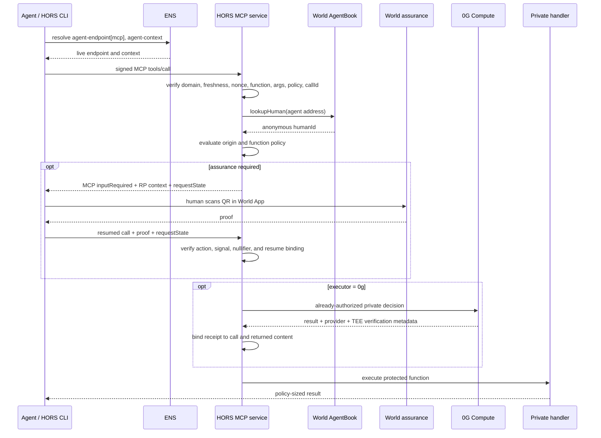

# HORS architecture and rationale

## The problem HORS is solving

Agent protocols have made communication and tool invocation interoperable:

- [A2A](https://a2a-protocol.org/latest/specification/) defines agent
  capabilities, tasks, messages, and interactions.
- [MCP](https://modelcontextprotocol.io/specification/draft/basic/authorization)
  defines how a client discovers and invokes tools, with resource-bound OAuth
  available for protected servers.
- [ENSIP-26](https://docs.ens.domains/ensip/26/) defines text records for
  locating and describing agent services.

Those standards deliberately do not define one universal private security
origin for a person's independently walleted agents. Authorization remains tied
to each service's own identity and policy system.

That becomes a concrete problem when a person uses:

- a local open-source calendar agent;
- a cloud finance agent from one vendor;
- a mobile travel agent from another vendor; and
- a personal MCP service holding sensitive state.

The agents have different wallets, runtimes, providers, and credentials. They
should not share a master account or a long-lived bearer token. Yet the service
needs to answer more than “is this a valid MCP client?”

It needs to answer:

1. Which anonymous human backs this agent wallet?
2. Is that the same human who owns this private service?
3. Is this particular function callable by agents?
4. Does this exact invocation require a live person or document-backed
   assurance?
5. Must the protected decision run through a verified executor?
6. Is the caller signing the same function, arguments, domain, and policy the
   server is evaluating?

HORS turns those questions into one declarative function policy and a
fail-closed request path.

## Functions, not raw state

There are two obvious personal-agent architectures, and both are incomplete.

### One super-agent

A single agent receives every inbox, transaction, credential, wallet permission,
calendar event, and private memory. Coordination is easy, but the compromise
boundary is the person's entire digital life.

### Fully isolated agents

Each agent sees only its own silo. The blast radius is smaller, but the agents
cannot usefully cooperate.

### The HORS model

Keep state inside narrowly scoped services and expose private functions over it.
For example:

```ts
calendar.findCompatibleWindow({ durationDays: 3, before: "2026-09-20" });
work.approveTravelExpense({ amount: 850, currency: "EUR", purpose: "client visit" });
travelEligibility.canEnter({ jurisdiction: "Portugal", dates });
```

The agent receives the policy-approved result, not the underlying calendar,
balance, transaction history, or identity document. A service author can still
choose to expose data, but HORS makes derived functions the natural boundary.

## What “human origin” means

In HORS, the origin is the anonymous `humanId` returned by World AgentBook for a
registered agent wallet. Two independently walleted agents backed by the same
person resolve to the same human-level state.

The identifier is used as an authorization root, not as a public profile:

```text
caller agent address
        │
        │ AgentKit signature and resource checks
        ▼
AgentBook lookupHuman(agent)
        │
        ├── no humanId ─────────── deny
        ├── different humanId ──── deny
        └── same humanId ───────── evaluate function policy
```

Same-human is a prerequisite, not blanket permission. A policy can still make a
function public, admit any human-backed agent, require Selfie or Identity
assurance, require 0G execution, or forbid every agent call.

## From CORS to HORS—and where the analogy stops

CORS made origin policy a reusable server configuration rather than custom
access logic in every route. HORS aims for the same developer ergonomics:

```ts
service.hors(
  "work.approveTravelExpense",
  {
    origin: "same-human",
    assurance: "selfie",
    executor: "0g",
  },
  handler,
);
```

The analogy maps as follows:

| Browser web | Agent service web |
| --- | --- |
| DNS | ENS service discovery |
| Scheme/host/port origin | Anonymous AgentBook human origin |
| CORS route policy | HORS function policy |
| Request origin metadata | Resource-bound agent signature |
| Permission prompt | MCP `inputRequired` plus World assurance |

The enforcement model is different. A browser is a trusted participant in CORS;
an arbitrary agent is not. HORS therefore verifies requests server-side and
does not implement or claim a browser-style preflight protocol.

## Request flow



### What the signature binds

The `Hors-Authorization` payload binds:

- the expected service domain;
- the agent wallet and signature type;
- the function URI;
- issuance and expiration time;
- a nonce;
- the recursive canonical hash of tool arguments;
- the policy content hash; and
- a unique call ID.

The service recomputes these values from the received MCP call. This prevents a
valid signature for one function, argument object, service, or policy version
from being replayed as another.

### What step-up state binds

For Selfie or Identity, HORS returns an MCP `inputRequired` result with
server-authenticated `requestState`. The state binds the caller address,
`humanId`, function, call ID, arguments hash, required assurance, World action,
and expected signal hash. The resumed call is rejected if any of those values
changes or if the state or proof nullifier is reused.

### What the 0G receipt binds

A handler cannot satisfy an `executor: "0g"` policy with an arbitrary JSON
object. `hors-server` brands receipts produced through the registered executor
and checks the function, call ID, arguments hash, provider, TEE status, and
returned text content before the response is accepted.

The current `hors-executor-0g` default is:

```ts
{
  trustMode: "verified",
  verifyTee: true
}
```

This is verifiable Galileo execution, not a claim of sealed private-mode
inference. The executor can accept an independent verification callback that
checks the provider response through the 0G Compute SDK.

## Three load-bearing protocol roles

### World: portable human origin and call-specific assurance

AgentKit provides a shared anonymous origin across independent wallets without a
common vendor account, root wallet, or user-operated credential issuer.

Selfie Check adds low-friction presence for a sensitive call. It is not treated
as KYC or legal identity. Identity Check provides document-backed assurance for
the higher-risk tier, without passing raw document images or document fields to
the agent.

### ENS: owner-controlled service mobility

The HORS client currently resolves exactly two records:

- `agent-endpoint[mcp]`
- `agent-context`

This makes discovery functional rather than cosmetic. A service owner can
change the endpoint record, and newly resolving agents follow it without an
application release or vendor-managed directory update.

The service ID and HORSRegistry address are supplied separately to the current
CLI cache. HORS does not claim a complete ENS service graph or ENSIP-25
registration backlink in this implementation.

### 0G: public policy evidence and verified execution

The three 0G layers have separate responsibilities:

| Layer | HORS use |
| --- | --- |
| Chain | HORSRegistry stores owner, version, Storage root, policy hash, and compact function policies |
| Storage | Stores and proof-downloads the full public policy manifest |
| Compute | Evaluates protected decisions and returns provider/TEE metadata that HORS must validate |

In the Call Home demo, the CLI verifies the published manifest for inspection
while the service enforces its inline `service.hors()` policies. The manifest
and runtime configuration are therefore complementary evidence, not a claim
that the server automatically reads its policy from chain on every call.

## Alternatives and trade-offs

### MCP OAuth / OIDC

Modern MCP authorization can bind tokens to resource servers, advertise scopes,
and challenge for additional scope. It can absolutely implement tool-specific
authorization.

HORS is useful when unrelated agents and the private service do not already
share an authorization server or identity provider. AgentBook supplies the
portable same-human root; HORS then binds that origin to the individual call.
The two systems can be composed: OAuth can authenticate or authorize the client
ecosystem while HORS applies human-origin policy.

### Smart account and session keys

A root smart account can issue narrow session keys to multiple agents and may be
the simplest design inside one wallet ecosystem. HORS instead permits each agent
to retain a fully independent wallet and registration.

### DID and Verifiable Credentials

A person or issuer can issue “belongs to this agent family” credentials. This is
more general, but requires an issuer, credential lifecycle, and verifier trust
configuration. World gives HORS an existing human-backed registry and a standard
agent enrollment path.

### Solid / ACP

Solid's policy systems can authorize resources using identities and
credentials. HORS differs mainly in its default unit of composition: an MCP
function returning a derived answer instead of a raw personal-data resource.

### Static configuration

An endpoint in a config file can replace ENS. That is perfectly reasonable for
one deployment, but it reintroduces per-client configuration and vendor
coupling. ENS makes the service location owner-controlled and updateable.

### Conventional cloud inference

Any compute provider can run the private decision. Replacing 0G removes the
HORSRegistry/Storage evidence path and the executor's TEE verification contract.

## Trust boundaries

HORS is designed around explicit boundaries:

- The caller is untrusted. Every protected call is signed and revalidated.
- Same-human is not consent for every operation. The function policy remains
  authoritative.
- Selfie proves live presence and continuity at the configured assurance level;
  it is not a legal identity claim.
- Identity Check supplies World-verified document-backed assurance; HORS does
  not receive the raw identity document.
- The published manifest is public policy metadata, not private user memory.
- `verified` 0G trust mode is described as verified execution, not sealed
  private-mode inference.
- The deterministic policy gate runs before model inference. A model cannot
  expand its own permissions.
- `agentCallable: false` is an unconditional server-side denial, including for
  an agent backed by the service owner.

## Design direction

HORS is an SDK and working MCP prototype today. Its protocol direction is:

- a standard A2A advertisement for human-origin requirements;
- richer ENS-discovered personal service graphs;
- distributed replay and step-up state for multi-region gateways;
- sealed executor profiles and independently verifiable 0G receipts; and
- portable policy receipts that downstream services can verify without learning
  the private inputs.

For the implementation surface, continue with the [SDK guide](SDK.md).
